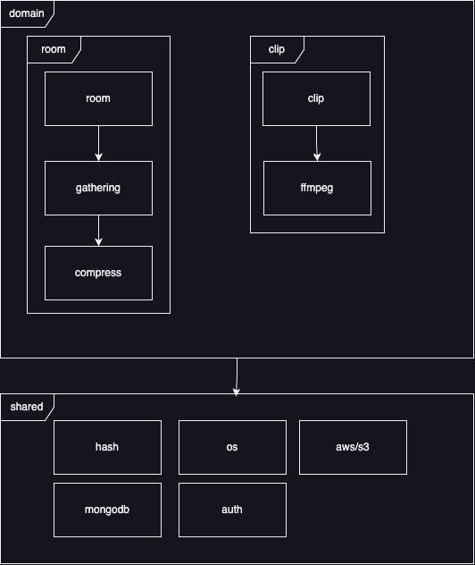

## Rolling Video Server

## Requiredment

| dependency | least version |
| :--------- | :------------ |
| npm        | 8.19.4        |
| node       | 16.20.2       |
| pm2        |               |
| ffmpeg     |               |

## Modules



| depth-1 | depth-2 | depth-3   | depth-4 | description    |
| :------ | :------ | :-------- | :------ | :------------- |
| domain  | room    |           |         | 영상 방 관련   |
|         |         | gathering |         | 영상 취합      |
|         |         | compresss |         | 파일 압축      |
|         | clip    |           |         | 영상 클립 관련 |
|         |         | ffmpeg    |         | 영상 변환      |
| shared  | os      |           |         | OS 커맨드 관련 |
| shared  | auth    |           |         | 인증 관련      |
| shared  | aws     | s3        |         | AWS S3 제어    |
| shared  | hash    |           |         | 해시 관련      |
| shared  | mongodv |           |         | mongodb 제어   |

## How to build

1. clone project

2. make .env file on root

```
NODE_ENV=/* ... */
MONGODB_URL=/* ... */
AWS_ACCESS_KEY_ID=/* ... */
AWS_SECRET_ACCESS_KEY=/* ... */
AWS_REGION=/* ... */
AWS_S3_BUCKET_NAME=/* ... */
```

3. install prerequirements

> TODO : this isn't work now..

```
./script/setup.sh
```

4. run server

```
./script/build.sh
```

build.sh do below jobs

1. install dependencies from package.json
2. do npm run build
3. reload pm2 through ecosystem.json

## make third-party-licenses.txt

licenses file is created by [generate-license-file](https://github.com/TobyAndToby/generate-license-file)

```
npx generate-license-file --input package.json --output third-party-licenses.txt --overwrite
```
